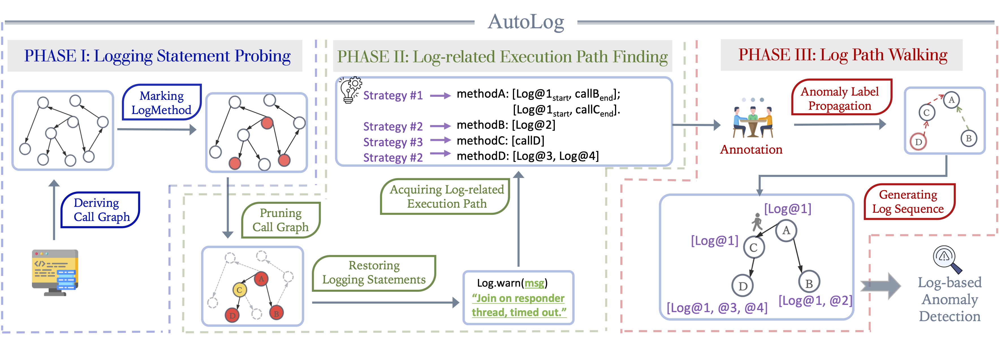

# AutoLog
**UNDER CONSTRUCTION**🔨


Collect &amp; Analyze application log sequence from the perspective of program analysis


The repository consists of multiple folders. The folder `/src` includes source code. The folder `/data` contains the generated demo data from AutoLog. The folder `/scripts` contain some useful scripts. The folder `/third-party` includes two open-source program analysis tools we adpated in this project. The folder `/build` contains some builded artifacts.

### Generated Datasets

The demo datasets are shown in the **folder `/data`**.

**Sample:**

```json
{"9E4C996176B68B9A5F521819A453BB91": {"templates": [......, 
"Resolved path is  <*> ",
 "ACCESS CHECK:  this , doCheckOwner= <*> , ancestorAccess= <*> , parentAccess= <*> , access= <*> , subAccess= <*> , ignoreEmptyDir= <*> , resolveLink= <*> ",
"UnresolvedPathException  path:  <*>  preceding:  <*> count:  <*>  link:  <*>  target:  <*>  remainder:  <*> ",
"Could not get full path. Corresponding file might have deleted already.",
"Could not get full path. Corresponding file might have deleted already."
], "label": 1}
```

**Sample raw data:**

```html
INFO org.apache.hadoop.hdfs.server.namenode.FSNamesystem: HA Enabled:  <*> 
INFO org.apache.hadoop.hdfs.server.namenode.FSNamesystem: Append Enabled:  <*> 
INFO org.apache.hadoop.hdfs.server.namenode.FSDirectory: Caching file names occuring more than  <*>  times 
INFO org.apache.hadoop.hdfs.server.namenode.CacheManager: Using minimum value <*> for <*>
WARN org.apache.hadoop.hdfs.server.namenode.FSNamesystem$SafeModeInfo: The threshold value should not be greater than , threshold:  <*> 
INFO org.apache.hadoop.hdfs.server.namenode.FSNamesystem$SafeModeInfo: dfs.namenode.safemode.threshold-pct =  <*> 
INFO org.apache.hadoop.hdfs.server.namenode.FSNamesystem$SafeModeInfo: dfs.namenode.safemode.min.datanodes =  <*> 
INFO org.apache.hadoop.hdfs.server.namenode.FSNamesystem$SafeModeInfo: dfs.namenode.safemode.extension     =  <*> 
INFO org.apache.hadoop.hdfs.server.namenode.NNConf: ACLs enabled?  <*> 
```

### Execution

You can play with this analysis framework with multiple ways.

* `LogStatGen.jar`: fetch and restore log statements from analyzed artifacts for preliminary labelling.
* `LogEPGen.jar`: acquire log-related execution paths.
* `javacg.jar`: generate call graph from java project.
* `log_methods_generator.py`: a simple way to generate pruned call graphs.
* `log_sequence_generator.py`: log path walking.


Instruction for getting project logging statements, you can conduct statement-level labelling for further anomaly detection.
```bash
java -jar LogStatGen.jar -j input_jar.jar -o log_methods.txt -m 'log'
```

Instruction for running the callgraph generators

```bash
java -jar javacg-0.1-SNAPSHOT-static.jar lib1.jar ... > cg.txt
```

Instruction for pruning log-related call graphs

```bash
python generate_log_methods.py --cg cg.txt --output log_methods.csv --matcher 'log'
```

Instruction for getting logEP for log-related methods, , you can conduct path-level labelling for further anomaly detection.

```bash
java -jar LogEPGen.jar -j input_jar.jar -l log_methods.txt -o log_file.json
```

Instruction for the generated log sequences (without labelling):
```bash
python log_sequence_generator.py --call-graph-file cg.txt --log-file log_file.json --label-file log_methods.csv --output-path gen_log.txt --length 1000000
```
